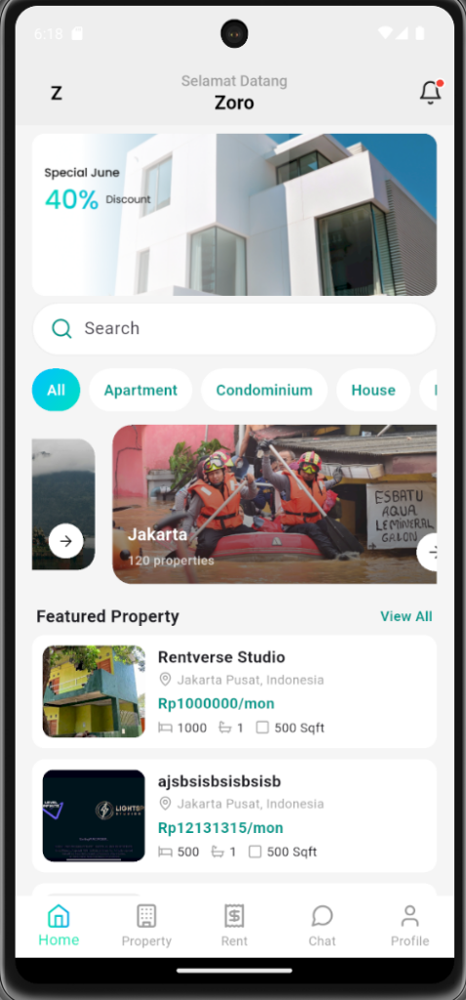
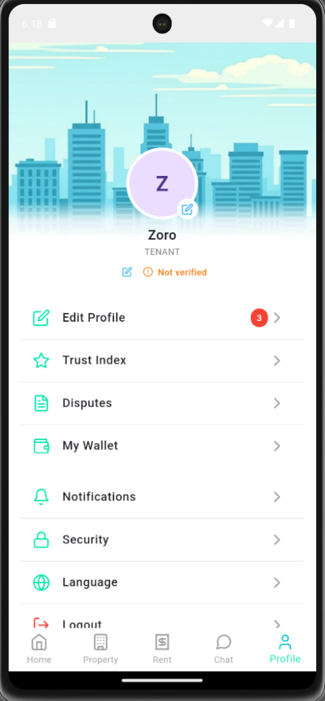

# Troubleshooting Report: Android Authentication Failure

## Observed Symptoms

- **Users unable to log in**: Login attempts failed with HTTP 401/403 errors
- **Session invalidation**: User sessions were immediately invalidated after login
- **OTP verification failure**: OTPs were sent successfully to email but verification failed on the mobile client

## Root Cause Analysis

The authentication failure was caused by **6 bugs** across 3 source files:

### 1. Authorization Header Typo
- **File**: `lib/core/network/interceptors.dart` (Line 35)
- **Bug**: Header name was `'authorizatiom'` (typo with 'm' instead of 'n')
- **Impact**: Server ignored the malformed header, treating all requests as unauthenticated

### 2. Missing Space in Bearer Token
- **File**: `lib/core/network/interceptors.dart` (Line 35)
- **Bug**: Token format was `'Bearer$token'` instead of `'Bearer $token'`
- **Impact**: Invalid Authorization header format caused rejection by the server

### 3. Wrong SharedPreferences Key (String Literal)
- **File**: `lib/features/auth/data/source/auth_local_service.dart` (Lines 28, 36)
- **Bug**: Token saved to key `"TOKEN_KEY"` (string literal) instead of constant `TOKEN_KEY` which equals `'access_token'`
- **Impact**: Interceptor read from `'access_token'` but token was stored at `'TOKEN_KEY'` - mismatch caused token to never be found

### 4. Leading Space in Token Value
- **File**: `lib/features/auth/data/source/auth_local_service.dart` (Lines 28, 36)
- **Bug**: Token saved as `" $token"` with a leading space
- **Impact**: Even if key matched, the token value was corrupted with extra whitespace

### 5. OTP Send Endpoint Typo
- **File**: `lib/features/auth/data/source/auth_api_service.dart` (Line 120)
- **Bug**: Endpoint was `/auth/otp/sent` (past tense) instead of `/auth/otp/send`
- **Impact**: 404 Not Found when attempting to request OTP

### 6. OTP Verify Endpoint Typo
- **File**: `lib/features/auth/data/source/auth_api_service.dart` (Line 136)
- **Bug**: Endpoint was `/auth/otp/verifi` (truncated) instead of `/auth/otp/verify`
- **Impact**: 404 Not Found when attempting to verify OTP

## Applied Fixes

### interceptors.dart
```diff
- options.headers['authorizatiom'] = 'Bearer$token';
+ options.headers['Authorization'] = 'Bearer $token';
```

### auth_local_service.dart
```diff
- await _sharedPreferences.setString("TOKEN_KEY", " $token");
+ await _sharedPreferences.setString(TOKEN_KEY, token);
```
```diff
- await _sharedPreferences.setString("TOKEN_KEY", " $accessToken");
+ await _sharedPreferences.setString(TOKEN_KEY, accessToken);
```

### auth_api_service.dart
```diff
- final response = await _dioClient.post('/auth/otp/sent', data: body);
+ final response = await _dioClient.post('/auth/otp/send', data: body);
```
```diff
- final response = await _dioClient.post('/auth/otp/verifi', data: body);
+ final response = await _dioClient.post('/auth/otp/verify', data: body);
```

## Evidence of Resolution

The following screenshots demonstrate the app successfully logged in and maintaining a user session:

### Home Screen (Logged In)


### Profile Screen (Session Active)


**Verification Date**: 2025-12-29

The user "Zoro" is successfully authenticated and can access all app features including Home, Property listings, and Profile settings.
